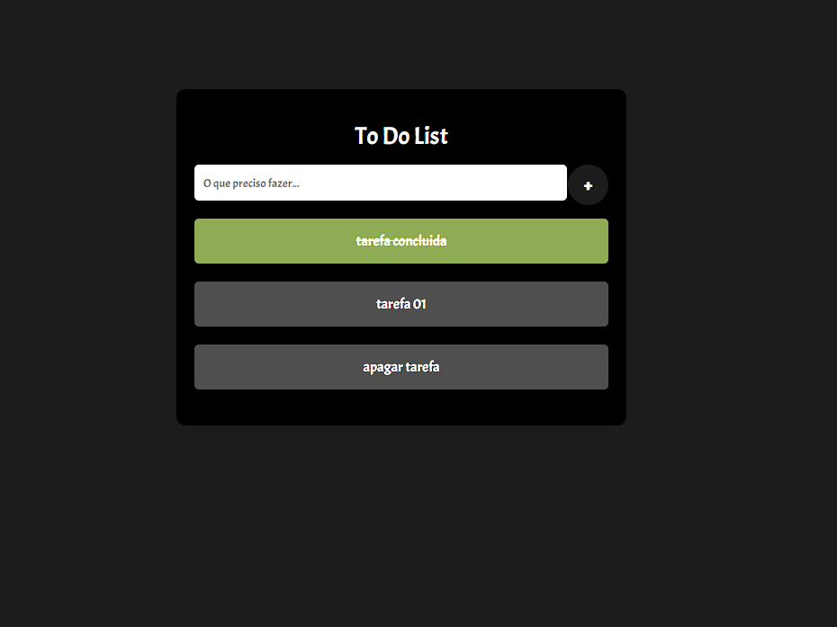

Claro, aqui está um exemplo de README para o seu aplicativo To-Do List:

# Aplicativo To-Do List

Este é um aplicativo simples de lista de tarefas ("To-Do List") que permite criar e gerenciar tarefas diárias. 
Você pode adicionar novas tarefas, marcar tarefas como concluídas e excluí-las quando necessário.

## Pré-Visualização

## Como Usar

1. Na página inicial do aplicativo, você verá um campo de entrada onde pode digitar o que precisa fazer.

2. Digite o nome da tarefa que você deseja adicionar e clique no botão "+" para adicionar tarefa à sua lista.

3. Para marcar uma tarefa como concluída, clique no ícone de verificação ao lado dela.

4. Se desejar excluir uma tarefa, clique no ícone de lixeira ao lado dela.

5. As tarefas concluídas serão marcadas automaticamente com um estilo diferente.

6. Se você recarregar a página, suas tarefas serão mantidas graças ao uso do armazenamento local (localStorage).

## Tecnologias Utilizadas

- HTML
- CSS (arquivo `styles.css`)
- JavaScript (arquivo `scripts.js`)
- Biblioteca SweetAlert para notificações visuais

