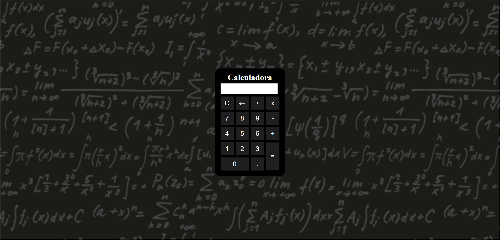

Aqui está um exemplo de README para o seu aplicativo de calculadora:

# Calculadora Simples

Esta é uma calculadora simples desenvolvida em HTML, CSS e JavaScript que permite aos usuários realizar operações matemáticas básicas, como adição, subtração, multiplicação e divisão.

## Pré-Visualização

## Como Usar

1. Na tela inicial, você verá uma grade de botões que representam números, operadores e ações.

2. Clique nos botões numéricos ou digite para inserir os números na tela de resultados.

3. Use os botões de operadores (+, -, *, /) para selecionar a operação desejada.

4. Clique no botão "=" para calcular o resultado da expressão inserida.

5. Se cometer um erro ou desejar apagar um caractere, use o botão "&larr;" para retroceder.

6. Para limpar a tela de resultados, clique no botão "C".

7. O resultado da expressão será exibido na parte superior da calculadora.

## Tecnologias Utilizadas

- HTML
- CSS (arquivo `style.css`)
- JavaScript (arquivo `script.js`)
- JavaScript (arquivo `keyPress.js` para suporte a teclado)

