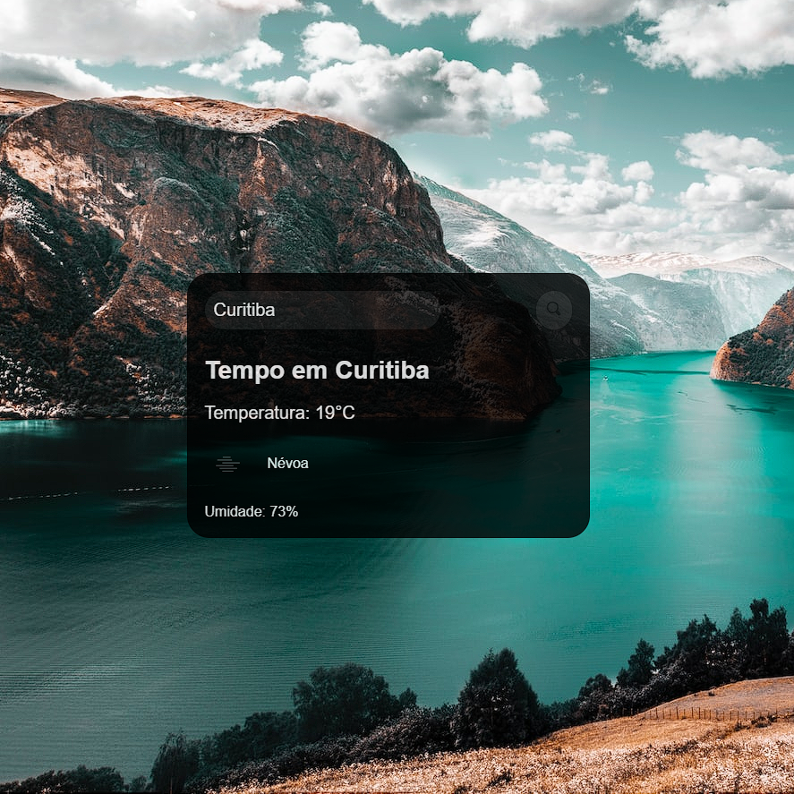

Claro, aqui está um exemplo de README para o seu aplicativo de previsão do tempo:

# Aplicativo de Previsão do Tempo


Este é um aplicativo simples de previsão do tempo que permite obter informações sobre o clima de uma cidade específica. O aplicativo utiliza a API do OpenWeatherMap para obter dados meteorológicos em tempo real.

## Como Usar

1. Na página inicial do aplicativo, você verá uma caixa de texto para digitar o nome da cidade para a qual deseja verificar o clima.

2. Após inserir o nome da cidade, clique no botão de busca para obter a previsão do tempo.

3. A previsão do tempo será exibida na parte inferior da página, incluindo informações sobre a temperatura, descrição do clima e umidade.

4. Uma representação gráfica do clima atual também será exibida na forma de um ícone.

## Exemplo



## Tecnologias Utilizadas

- HTML
- CSS (arquivo `styles.css`)
- JavaScript (arquivo `scripts.js`)
- API do OpenWeatherMap

## Configuração

Antes de usar o aplicativo, é necessário configurar a chave da API do OpenWeatherMap. Siga estas etapas:

1. Obtenha uma chave de API gratuita no [OpenWeatherMap](https://openweathermap.org/).

2. Substitua a variável `key` no arquivo `scripts.js` pela sua chave de API.

```javascript
const key = "SUA_CHAVE_DE_API_AQUI";
```


